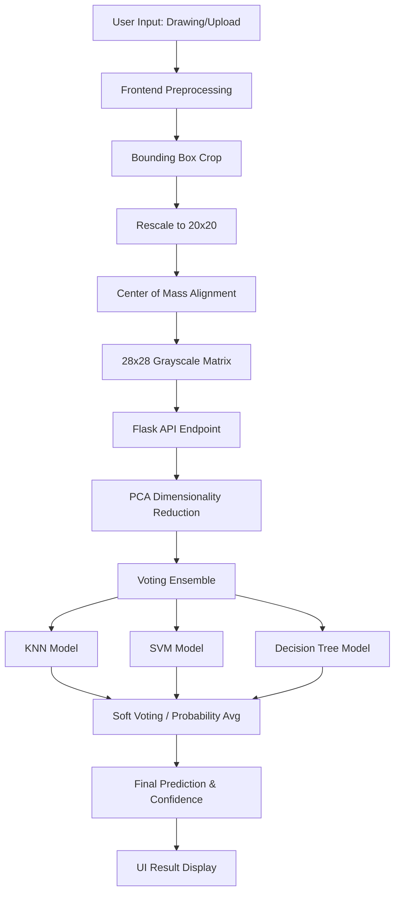

# 🧠 Intelligent Digit Recognizer (Classical ML)

A professional, full-stack web application that recognizes handwritten digits in real-time using an **Optimized Classical ML Ensemble**. This project strictly adheres to assignment constraints by utilizing KNN, SVM, and Decision Trees, while delivering a modern, glassmorphic UI.


---

## ✨ Key Features

- **🎨 Interactive Drawing Board**: Smooth, high-precision drawing interface with real-time stroke softening.
- **📁 Image Upload**: Drag-and-drop support for digit images with automatic preprocessing.
- **⚡ Real-time Prediction**: Instant analysis powered by a **Voting Ensemble** of KNN, SVM, and Decision Trees.
- **🔬 Advanced Preprocessing**:
    - Bounding-box detection and cropping.
    - **Center of Mass** alignment (MNIST standard).
    - Gaussian-style stroke softening for improved robustness.
- **💎 Premium UI/UX**: Dark mode aesthetic with glassmorphism, smooth animations, and responsive design.

---

## 🛠️ Tech Stack

### Frontend
- **React 18** (Vite)
- **Tailwind CSS v4** (Modern styling)
- **Lucide React** (Beautiful iconography)
- **Canvas API** (Custom drawing logic)

### Backend
- **Python / Flask** (API Layer)
- **Scikit-learn** (Classical Machine Learning)
- **NumPy & Pandas** (Data processing)
- **Flask-CORS** (Cross-origin resource sharing)

---

## 📊 Technical Flow Diagram



---

## 🚀 Getting Started

### Prerequisites
- Node.js (v18+)
- Python 3.10+
- `pip` (Python package manager)

### 1. Setup Backend
Open a terminal in the root directory:
```bash
# Install dependencies
pip install flask flask-cors numpy pandas scikit-learn

# Run the server
python server.py
```
*Note: On first run, it will train the Neural Network on the full 60,000 MNIST samples (~1 minute).*

### 2. Setup Frontend
Open another terminal:
```bash
cd frontend
npm install
npm run dev
```

The app will be available at `http://localhost:5173`.

---

## 🧠 How it Works

1.  **Input**: The user draws a digit on a 400x400 canvas.
2.  **Preprocessing**:
    *   Finds the bounding box of the strokes.
    *   Resizes to a 20x20 window while maintaining aspect ratio.
    *   Calculates the **Center of Mass** of the pixels.
    *   Places it into a 28x28 frame such that the center of mass is exactly at (14, 14).
3.  **Dimensionality Reduction**: The 784 features are reduced to 50 using **PCA** (Principal Component Analysis) to improve model speed and generalization.
4.  **Voting Ensemble**: Three classical models vote on the final prediction:
    *   **K-Nearest Neighbors (KNN)**: Tuned for handwriting patterns.
    *   **SVM (RBF Kernel)**: High-dimensional boundary classification.
    *   **Decision Tree**: Rule-based logic for digit structure.

---

## 📂 Project Structure

```text
├── frontend/             # React application
│   ├── src/
│   │   ├── components/   # UI Components (Canvas, Upload, etc.)
│   │   └── App.tsx       # Main logic & API integration
├── server.py             # Flask Backend & Neural Network logic
├── mnist_train.csv       # Dataset for training
└── handwritten-digit-recognition.ipynb # Original research notebook
```

---

## 👤 Author

Developed with ❤️ for the **Digit Recognition Challenge**.

---

> [!TIP]
> For best results, draw your digits reasonably large in the center of the board. The model is trained to handle various slants and thicknesses!
